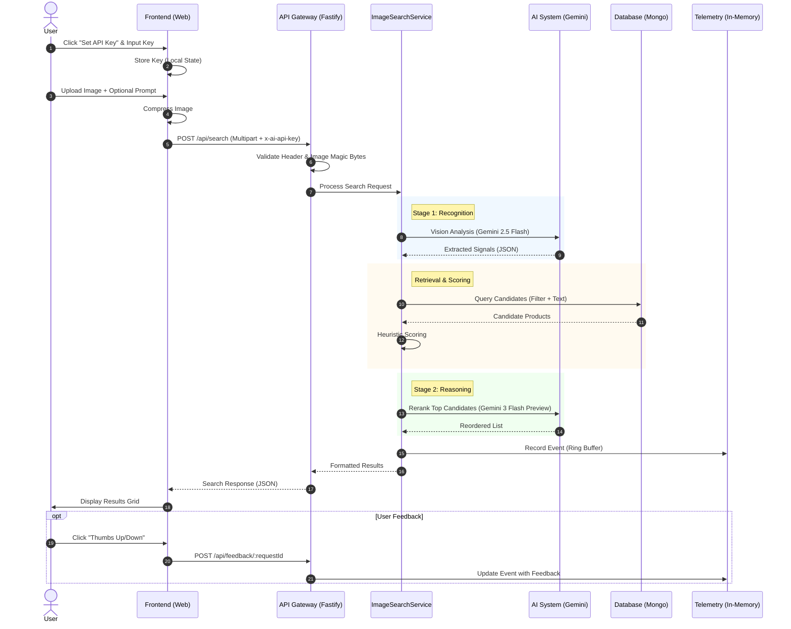

# Inspira AI — AI-Powered Product Search

Inspira AI is an agentic AI-powered furniture search engine. It allows users to upload an image of a furniture item and receive highly relevant, ranked matches from a catalog, optionally refining the results with natural language prompts.

This project was built as a technical assessment, focusing on **retrieval quality, ranking precision, and internal tunability**.

For a deep dive into the system architecture, design choices, and evaluation methodology, please refer to the [Technical Assessment Response](./docs/18-technical-assessment-response.md).


---

## ⚡ Quick Start (Docker)

The fastest way to run the entire stack (API, Web, and Database) is using Docker Compose.

1.  **Clone the repository**.
2.  **Start the services**:
    ```bash
    docker compose up
    ```
3.  **Access the applications**:
    -   **Web Interface**: [http://localhost:3000](http://localhost:3000)
    -   **API Health Check**: [http://localhost:4000/health](http://localhost:4000/health)
    -   **Admin Panel**: Accessible via the "Admin" tab in the Web UI or via `/api/config`.

### Key API Endpoints
-   `POST /api/search`: Main image + prompt search.
-   `GET /api/config`: View current system weights and thresholds.
-   `POST /api/feedback/:requestId`: Submit thumbs up/down and notes for a search.
-   `GET /api/telemetry`: View live search insights (Admin Token required).

**First-run Checklist:**
1.  Open [http://localhost:3000](http://localhost:3000).
2.  Paste your **Google Gemini API Key** (Stored in-memory only).
3.  Upload an image of a furniture item.
4.  (Optional) Add a prompt like *"Scandinavian style, light wood"*.
5.  Click **Search** and explore the ranked results.

---

## 🛠️ Local Development (pnpm)

If you prefer to run the services natively:

### Prerequisites
-   **Node.js** >= 20
-   **pnpm** (recommended)
-   **MongoDB**: A connection string is required. A read-only public cluster is provided by default.

### Setup
1.  **Install dependencies**:
    ```bash
    pnpm install
    ```
2.  **Environment Configuration**:
    Copy `.env.example` to `.env` in the root:
    ```bash
    cp .env.example .env
    ```
3.  **Start Development Servers**:
    ```bash
    pnpm dev
    ```

---

## 🏗️ System Architecture

### Macro Overview
The system follows a modern full-stack architecture:
-   **Frontend**: Next.js (App Router) + TypeScript.
-   **Backend**: Node.js + Fastify + TypeScript.
-   **Database**: MongoDB (Read-only Product Catalog).
-   **AI Engine**: Google Gemini (2.5 Flash) for Vision and (3 Flash Preview) for Reranking.

### Visual Workflow


For comprehensive details, please refer to:
-   [**Detailed System Workflow**](./WORKFLOW.md): Full breakdown of logic, data flows, and failure scenarios.
-   [**Sequence Diagrams**](./WORKFLOW_DIAGRAMS.md): Detailed charts for the backend pipeline and failure recovery.

### The Matching Pipeline
The heart of Inspira AI is its **Two-Stage Search Pipeline**:

1.  **Signal Extraction (Stage 1)**:
    -   Gemini Vision analyzes the uploaded image.
    -   Extracts structured data: Category, Type, Visual Attributes (Style, Material, Color), and User Intent (Price/Dimensions).
2.  **Candidate Retrieval**:
    -   Highly optimized MongoDB queries using keyword relaxation (Plans A-D).
    -   If AI detection fails, the system automatically falls back to raw user prompt matching.
3.  **Heuristic Scoring**:
    -   All candidates are scored based on proximity to extracted signals (Text similarity + Category match + Attribute alignment).
4.  **LLM Reranking (Stage 2)**:
    -   The top-N candidates are sent back to Gemini along with the original image and signals.
    -   Gemini performs a final relative ranking to ensure visual alignment and precise user intent fulfillment.
5.  **Explainability**:
    -   Every result includes "Relevance Hints" explaining why it matched (e.g., *"Matched on walnut wood and minimalistic style"*).

---

## 🎛️ Admin & Tunability

Inspira AI includes an **Internal Admin Console** allowing back-office users to tune the search engine without code changes:
-   **Weights**: Adjust the importance of Text vs. Category vs. Dimensions vs. Style.
-   **Thresholds**: Define what constitutes a "High", "Medium", or "Low" match.
-   **Strategy**: Toggle LLM reranking and adjust candidate set sizes for performance/cost balance.
-   **Telemetry**: Real-time view of search performance, token usage, and user feedback.

---

## 📊 Quality Evaluation

To ensure relevance, Inspira AI includes a built-in evaluation framework:

### The "Golden Set"
We maintain a curated `golden-set.json` containing pairs of images + prompts with expected high-relevance matches.

### Metrics
We measure system performance using:
-   **Hit@1 & Hit@5**: Precision and Coverage of the top results.
-   **MRR (Mean Reciprocal Rank)**: The effectiveness of the ranking order.
-   **Prompt Lift**: A specialized metric measuring the objective value-add of the user's text prompt compared to image-only search.

### Run Evaluation
```bash
cd apps/api
pnpm eval:golden
```

---

## 🛡️ Security & Privacy
-   **Zero-Persistence API Keys**: Your AI provider keys are stored **only in memory** and are never written to disk or logs.
-   **Metadata Sanitization**: Uploaded images are stripped of EXIF data before processing.
-   **Sanitized Logs**: All sensitive headers (API keys, Admin tokens) are automatically redacted in system logs.

---

## 🚀 Future Enhancements
1.  **Vector Search**: Integrate a vector database (e.g., MongoDB Atlas Vector Search) for sub-second visual similarity at scale.
2.  **Hybrid Search**: Combine BM25 text search with Vector retrieval for the ultimate recall.
3.  **Image Pre-processing**: Add automated cropping and background removal to focus the AI on the primary object.
4.  **Persistent Feedback**: Store user evaluation events in a dedicated feedback database for continuous model fine-tuning.

---

## 📄 Documentation
-   [CHANGELOG.md](./CHANGELOG.md): History of all architectural and implementation decisions.
-   [API Docs](./apps/api/README.md): Detailed backend documentation.
-   [Architecture Docs](./docs/): Comprehensive project requirements and design guides.
