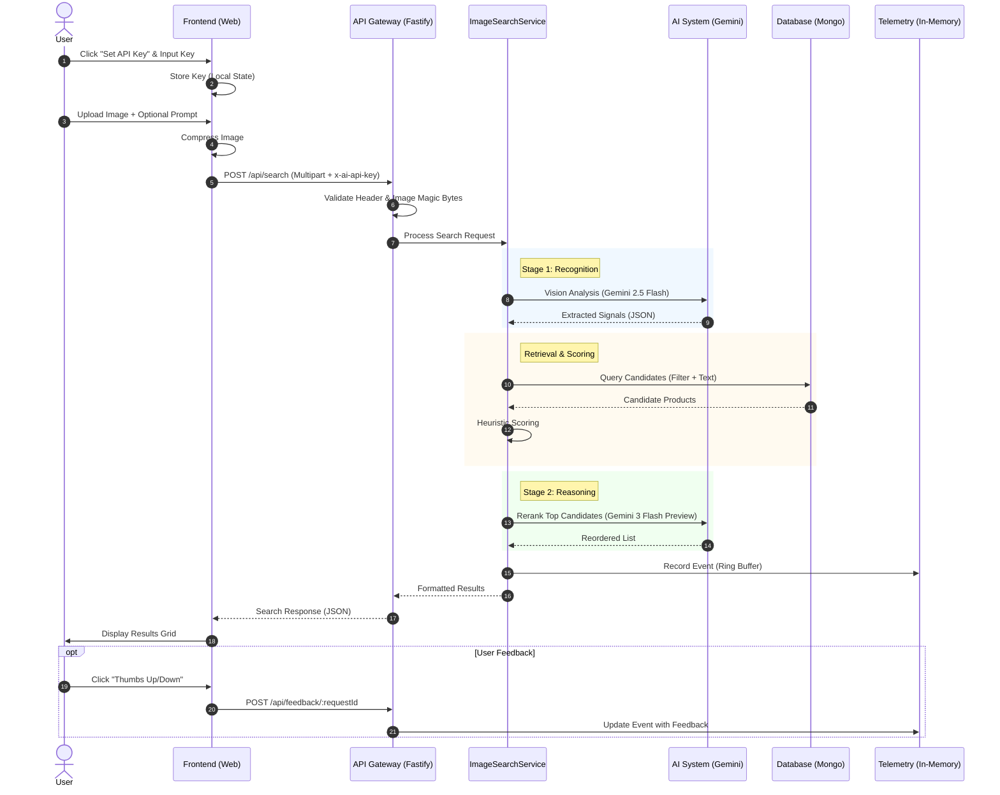
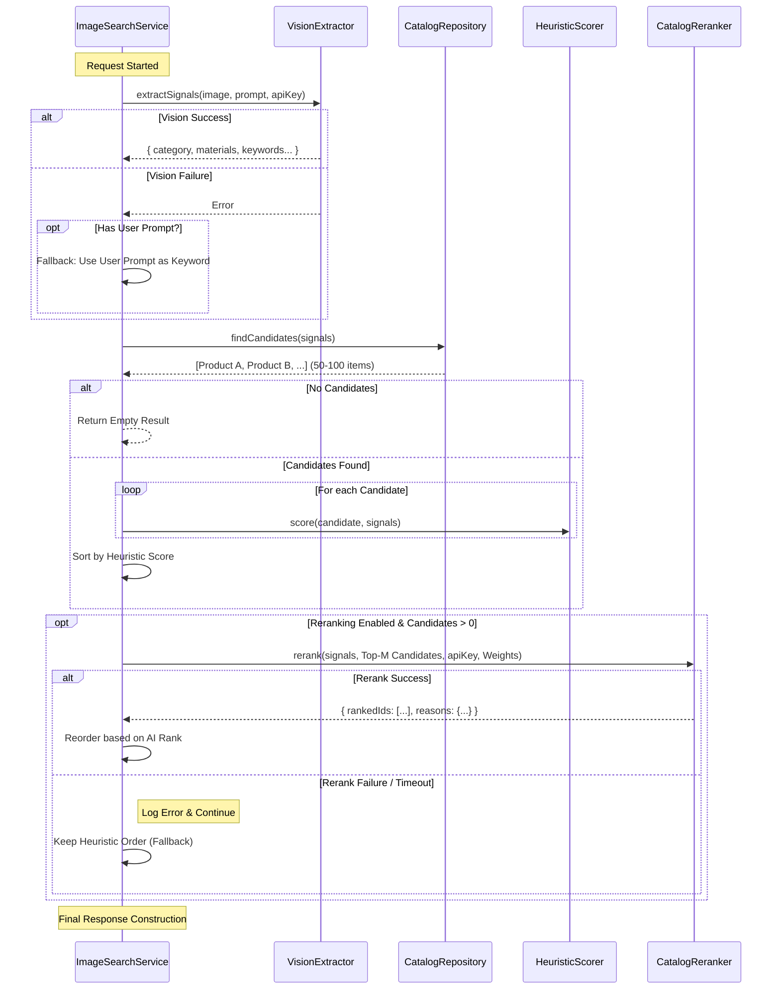
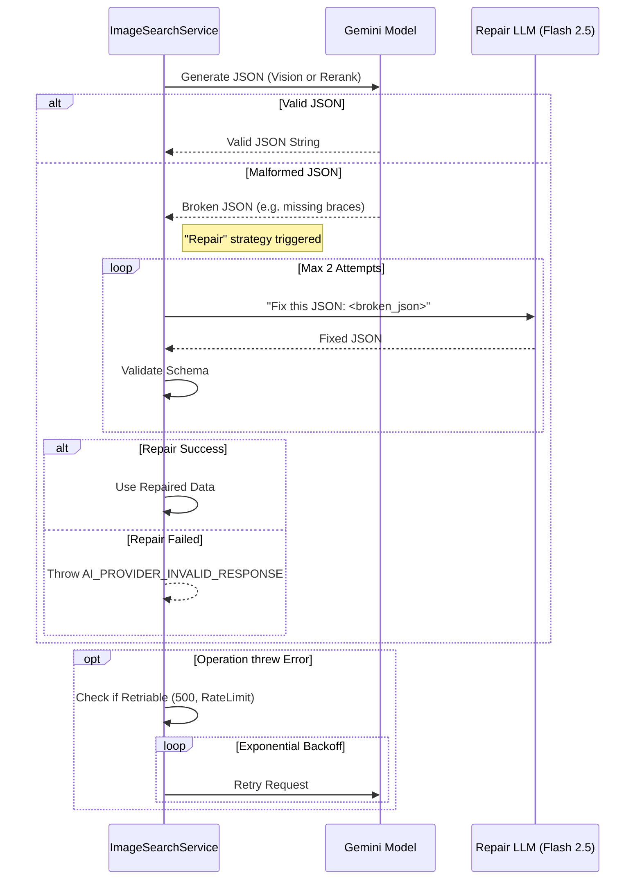

# System Workflow Diagrams

## 1. High-Level User Journey
This diagram illustrates the complete end-to-end flow from the user's perspective, including configuration and feedback.

## 2. Detailed Backend Pipeline
A deeper look into the `ImageSearchService` orchestration, logic branching, and error handling.

## 3. Failure & Repair Strategy
How the system handles AI unreliability (JSON errors) and Service failures.

